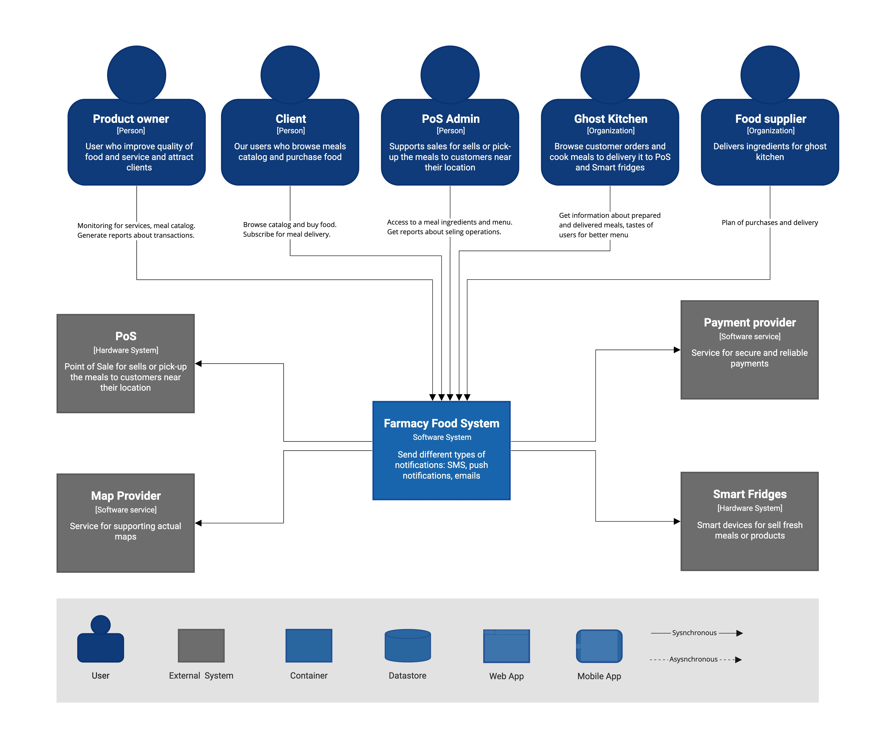
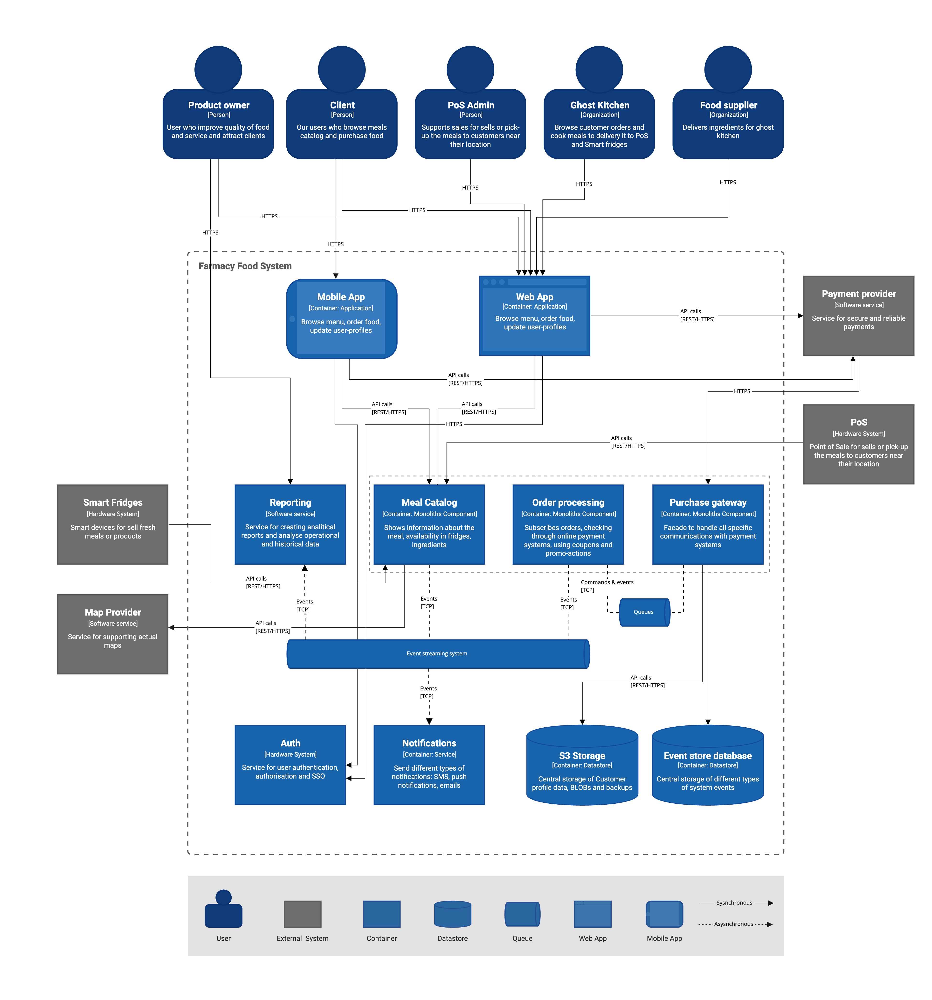
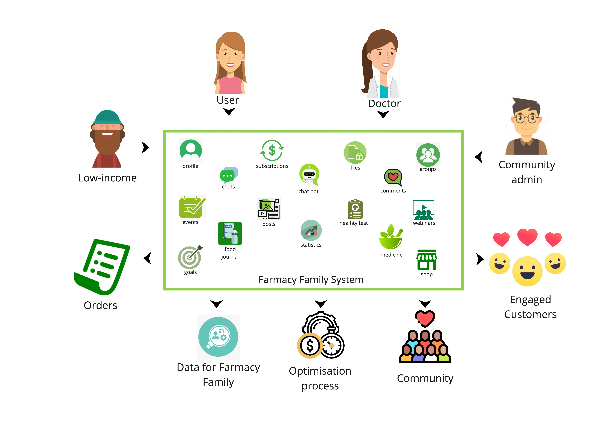
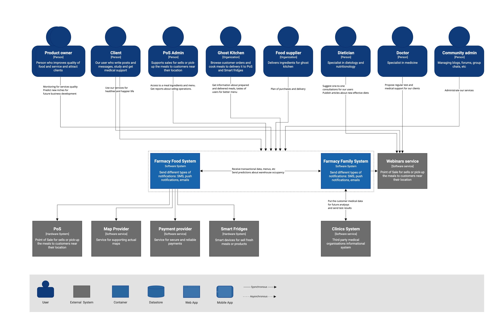
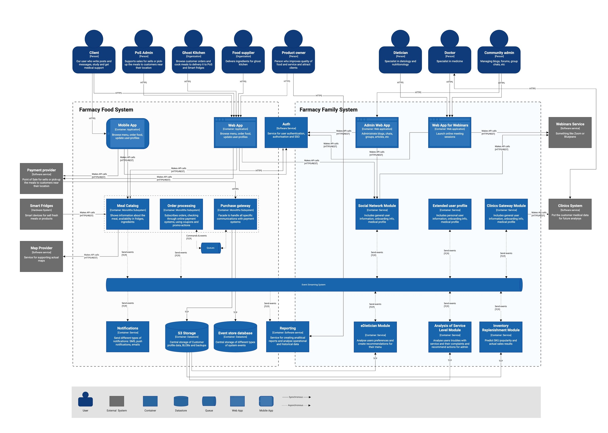
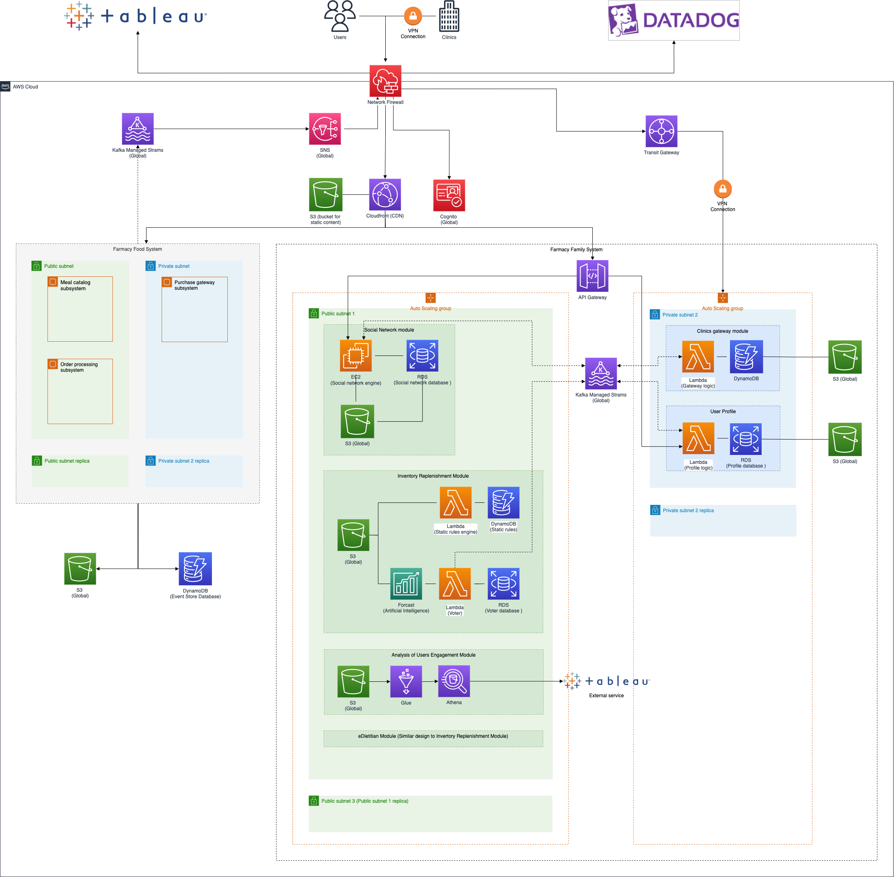

# The Farmacy Family Architectural Kata by O'Reilly

Welcome to the Farmacy Family Architectural Kata run by [O'Reilly](https://www.oreilly.com/) in October - November 2021. This is an architectural documentation for the solution proposal from Sever Crew.

## Contents
- [Welcome words](#welcome_words)  
    - [About the team](#about_the_team)
- [Overview](#overview)  
- [Baseline Architecture](#baseline_architecture)  
    - [Context](#baseline_context)
    - [Containers](#baseline_containers)
- [Initial requirements](#initial_requirements)  
    - [Primary goals](#primary_goals)
    - [User requirements](#user_requirements)
    - [Stakeholders](#stakeholders)
    - [Constraints](#constraints)
    - [User stories](#user_stories)
- [Target Architecture](#target_architecture)
    - [Context](#target_context)
    - [Containers](#target_containers)
    - [Assumptions](#assumptions)
    - [Significant Quality Attributes](#quality_attributes)
    - [Deployment](#deployment)
    - [Risks](#risks)
    - [Security](#security)
- [Architecture design records](#adrs)
- [Additional resources](#additional_resources)

## About the team 
Our team is a group of friends from the IT department of a vertically integrated steel and steel-related mining company [Severstal](https://www.severstal.com/eng/). We are all passionate about software design and development.

* [Oleg Krasnov](https://www.linkedin.com/in/oleg-krasnov/) 
* [Evgeny Sakirkin](https://www.linkedin.com/in/esakirkin/) 
* [Nastya Semchukova](https://www.linkedin.com/in/anastasia7chukova) 
* [Leonid Mironov](https://www.linkedin.com/in/leonid-mironov-88696690/) 
* [Petr Mironov](https://www.linkedin.com/in/%D0%BF%D0%B5%D1%82%D1%80-%D0%BC%D0%B8%D1%80%D0%BE%D0%BD%D0%BE%D0%B2-93ba92209/) 

## Overview 
Farmacy Food is a tech-enabled healthy food startup that takes the “Let food be thy medicine” quote literally and creates tasty meals around peoples’ dietary needs and active lifestyles to support their overall well-being. Our mission is to make health and wellness radically affordable and accessible.

Founder: Kwaku Ose

## Baseline architecture 
This is an actual FFood (designed by Arch Collider from the first Kata exercise - [ldynia/archcolider: O'Reilly's first Software Architectural Katas (github.com)](https://github.com/ldynia/archcolider)) system architecture. The customer interacts with Farmacy Food through well designed touch-points. 

Those are the:
* Cross-platform web and mobile apps
* Smart Fridges - food/drink kiosks that are situated in different locations and connected to the system using API.
* Point of Sales - sell our product but have an employee handle the transactions through a point of sale.

### Context 
The system context diagram below depicted key users of the system and its external dependencies:

### Containers 
The containers diagram shows the mid-level view of software design and how the containers communicate with one another in baseline architecture.

## Initial requirements 
Farmacy Family will be an enhancement of the existing Farmacy Foods system that adds tighter engagement with their customers. 

When a customer of Farmacy Food purchases a meal, the Farmacy Family will involve him into a community of people with the same perception of healthy eating and offer additional benefits for becoming an engaged customer.
 
 ### Primary goals 
The Product Owner establishes the following business goals:
* Develop relationships between engaged customers and nurture those relationships
* Convert transactional customers to engaged customers
* Generate analytical data from medical information to demonstrate the benefits of Farmacy Foods
* Engage customers with health education and marketing
* Develop new features and loyalty programs based on community data insights
* Increase partnership programs with clinics and dieticians

### User requirements 
There are some key requirements described by Product Owner: 
* Hundreds of transactional customers, separated by distinct geographic zones. 
* Additionally, different clusters of customers frequently consolidate around similar dietary requirements.
* A focus on ensuring that the entire offering is accommodating to low income, poverty, homeless, college students, educators, but also anyone who needs high quality, well sourced food in the neighborhood area. 
* Add a new system to manage customer profiles, allowing community engagement, personalization around preferences and dietary needs.
* Support geographical trend analysis to Farmacy Family’s ability to optimize the foods delivered to fridges (an additional integration point TO Farmacy Foods).
* Support both push and pull models for community engagement. In other words, the Farmacy Family will manage forums,emails, and create connections between similar demographics. The Farmacy Family needs transactional member information for outreach purposes. The engagement model includes subscriptions, forums, reference material, class information, and other media that supports Food-as-medicine.
* eDietian has access to customer profiles to improve advice and monitoring of customers. Additionally, the customer and dietitian can interact via messages.
* Farmacy Family wants to improve the distribution and potential food waste from having the wrong mix of foods in a particular fridge.
* Farmacy Family will include medical profile information and the ability to share information with medical service providers. 
* Farmacy Family customers can customize how much profile information they want to allow the community to see, at a fine-grained level.
* Farmacy Family has relationships with third party providers (clinics, doctors, etc) that have access to more analytical data to improve engagement (for example, regional dietary observations). 
* Add Farmacy Family user interface to existing Foods interface, which is currently a Reactive monolith. Create a holistic UX for both food and Farmacy Family to support engagement models. 

There are several engagement models:
* **Clients** - building a community, education process, increased awareness about healthy food and lifestyle
* **Clinics** - work with clinics to establish baseline regular tests for clients, analysing results and demonstrate any changes in customers overall health. This info could gain investors and additional support and help.
* **Dieticians** - Farmacy Foods supported generic advice from dieticians. Farmacy Family will support one-on-one advice for engaged customers based on regular contact via messages.
* **Family Foods** - watching which Transactional Customers (and their information) are not part of Farmacy Family to start the onboarding process for those customers.

Also, there are some additional information received during the [question and answer](pages/question_and_answers.md) session.

### Stakeholders 

This section describes key stakeholders and their concerns:
* **SH-1:** Farmacy Family users (engaged customers)
    * Clear and simple user interface
    * Useful services for healthier and happier life  
* **SH-2:** Farmacy Food users (transactional customers)
    * Easy onboarding process to be part of Farmacy Family
    * No additional authentication account for login Farmacy Family services
* **SH-3:** Helpdesk
    * Easy access to information about services falls, errors and exceptional situations
* **SH-4:** Product owner
    * Attract different types of clients to be   
    * Improve quality of provided food and services
    * Open new niches for business development
* **SH-5:** Ghost Kitchen and third party kitchens
    * Get information about prepared and delivered meals consuming to predict supply refilment
    * Get information about tastes of different communities for better menu and superior logistic 
* **SH-6:** Dieticians
    * Suggest one-to-one consultations for Farmacy Family users
    * Publish articles about new effective diets, natural and healthy food, etc
    * Search in catalog by specific components
* **SH-7:** Clinics (Doctors)
    * Propose regular test and help for Farmacy Family clients
    * Get information about health changes after tests
    * Support Farmacy Family client with several communication** **instruments
* **SH-8:** Food suppliers
    * Predict plan of purchases and delivery
* **SH-9:** Developers
    * Ease of developing and maintaining the system
* **SH-10:** DevOPS
    * Ease of monitoring
    * Ease of configuration and scaling
* **SH-11:** Community admin
    * Easy of managing blogs, forums, group chats, etc
* **SH-12:** Food Supplier

### Constraints 
Below listed global constraints for the solution that drives all trade-off decisions:
* **CON-1:** The new system must seamlessly incorporate into Farmacy Foods
* **CON-2:** Add Farmacy Family user interface to existing Foods interface, which is currently a Reactive monolith. Create a holistic UX for both food and Farmacy Family to support engagement model
* **CON-3:** The budget for development new system isn’t unlimited
* **CON-4:** Time-to-market is critical for most of startups so it should be quite straightforward CI/CD process
* **CON-5:** USA is the target geographic area
* **CON-6:** About medical profiles laws

### User stories 
**Profile**
* **US-1.1:** As a User I want to manage and restrict profile data and community should see only allowed by me information
* **US-1.2:** As a Client I want to be sure that doctors profile has been confirmed with necessary official documents and I should be informed that I will get a quality consultation
* **US-1.3:** As a Client I need that Farmacy Family mobile application will receive data from Apple Health or Google Fit without any manual operations
* **US-1.4:** As a Doctor I want clients will fill forms about their health to get primary information
* **US-1.5:** As a Client I need an opportunity to upload medical profiles and information to share with other medical specialists
* **US-1.6:** As a User I want an additional agreement about sharing my personal data to protect this information from third parties
* **US-1.7:** As a Dietician I want an opportunity to review data about health status of users to make recommendations on their diets
* **US-1.8:** As a User I need to get my medical profile from clinics without any manual operations or efforts
* **US-1.9:** As a Doctor I want to establish wellness goals for patients to improve their level of health and wellbeing
* **US-1.10:** As a Doctor I need full statistic about patients compliance with the goals to to evaluate their progress
* **US-1.11:** As a Low-income I want that medical profile should be as usable as possible for the client to answer the questions quickly and correctly
* **US-1.12:** As a Doctor I want to manage clients goals to quickly assign goals to a patient based on a template

**Social Network**
* **US-2.1:** As a User I want to have an opportunity to join a community of like-minded people to share interesting information
* **US-2.2:** As a User I need to participate in online and offline meetings to collaborate with community
* **US-2.3:** As a User I need an opportunity to post thoughts, photos, video to share my progress and knowledge with people
* **US-2.4:** As a User I want an opportunity for everyone in community to post some comments in my articles to to receive feedback
* **US-2.5:** As a User I want to join communities and group chats to find out the information I'm interested in
* **US-2.6:** As a User I want to communicate with other users with messages so that I can promptly receive information
* **US-2.7:** As a Doctor I need blog with some recommendations so that people could get received primary information without personal consultations
* **US-2.8:** As a Doctor I need opportunity to moderate group chats so that we could discuss common themes together
* **US-2.9:** As a User I want create and manage groups and group chats to publish content for a certain circle of people
* **US-2.10:** As a Low-income I want to get information and participate in charity events in order to get any help
* **US-2.11:** As a Low-income I want see minimal data in my user interface in order not to lose the necessary information
* **US-2.12:** As a User I want a better user interface so that i can easy find friends, posts and groups with useful information
* **US-2.13:** As a User I need to get notifications in order to be aware of all interesting events
* **US-2.14:** As a Doctor I want to share my docs and videos in order to organize better education and communication process
* **US-2.15:** As a Doctor I want to have an opportunity to sell extended consultations in order to receive income from participation
* **US-2.16:** As a User I need review of my individual set of posts in order to get relevant information

**Security**
* **US-3.1:** As a User I want to be sure that my data is in safe and will not get to third parties
* **US-3.2:** As a Product Owner I want to be sure that post, articles and blogs do not contain negative and illegal content in order not to cause negativity
* **US-3.3:** As a User I want to authorise using my Farmacy Food login so that i don't need to spend time to another registration process
* **US-3.4:** As a User I want to authorise using Facebook or Google login so that not to spend efforts to remember my Farmacy Family login and password
* **US-3.5:** As a  Low-income I want to have an opportunity to use application in a fast manner without any authentication

**Chat**
* **US-4.1:** As a Client I want to have an intelligent chatbot so that it suggest me meals depending on preferences and create an order not to waste my time ordering manually
* **US-4.2:** As a Doctor I need an intelligent chatbot so that it suggest me some recommendations based on established medical rules so that users will not receive "harmful advice"

**Webinars**
* **US-5.1:** As a Low-Income I want to get free consultation with a doctor so that i can receive medical care
* **US-5.2:** As a Doctor I need to have an opportunity to create webinars in order to educate Farmacy Family users
* **US-5.3:** As a Doctor I want to conduct consultations online in order to  interact more effectively with the patient

**Data analytics**
* **US-6.1:** As a Product Owner I want there to be a collection of geography data so that they are transferred to the Farmacy Family and used to optimize deliveries to refrigerators and reduce waste
* **US-6.2:** As a Product Owner I want to collect more analytical data in order to improve the Farmacy Food service
* **US-6.3:** As a Product Owner I want to know which transactional clients have become involved in order to apply incentives to them
* **US-6.4:** As a Client i want to be able to keep a food diary in order to receive individual recommendations on my taste preferences

**Others**
* **US-7.1:** As a Product Owner I want to negotiate a partnership with clinics in order to interact effectively
* **US-7.2:** As a Product Owner I want to make an order from Farmacy Family in order not to go to another site

## Target Architecture 
Here you find the documentation of the software architecture that we envision to address Farmacy Family's user requirements.

We distilled several key functional areas of Farmacy Family System:
* Rich user profile 
* Social Network with blogs, forums, posts, events, chats, media, groups, subscriptions, etc
* Webinars for education and online meetings
* Notifications through SMS, email and Push
* Integration with clinics and Farmacy Food System
* Data analysis for food and health recommendations and optimizations of logistic process
* Statistics and reports

Based on [primary goals](#primary_goals), [constraints](#constraints) and formalized [user stories](#user_stories), we extracted the following architecture views of Farmacy Family system design seen below. These views provide a contextual perspective of the system, showing mid-level building blocks and connectors which altogether correspond to the main capabilities provided by the Farmacy Family system.

We also investigated how UIs of the Farmacy Family might look like and develop several [UI prototypes](pages/ui.md) of web and mobile client applications.

### Context 
There's a context diagram that gives an overview of the external elements that interact with what we called the Farmacy Family System, which is the scope of this software architecture.

### Containers 
The containers diagram shows the mid-level viewpoint of the software architecture and how containers communicate with one another and with external services.

From the list of functional requirements and taking into account ADR, this architecture can provide all the functionality.

We intentionally drew a C4 container diagram including the Farmacy Food system to show integrations with its subsystems and components which we are going to reuse in the new Farmacy Family system.

Farmacy Family system contains of several services:
* **Web and mobile applications** - we incorporate new Farmacy Family functionality into existing Farmacy Food applications.
* **Social Network Module** - contains blogs, forums, posts, events, chats, media, groups, subscriptions, etc
* **Customer profile Module** - contains user sensitive personal and medical data
* **Webinars Module** - education and online meetings
* Artificial intelligence:
    * **eDietician Module** - see [dataflow description](pages/edietician.md)
    * **Inventory Replenishment Module**
    * **Analysis of Service Level Module**

We also could reuse some Farmacy Foods services:
* **Auth Module** - authentication, authorization and Single Sign On
* **Reporting Module** - generates different types of business reports
* **Event Streaming System** - for collecting events from all modules and as an integration layer
* **S3 Storage** - central data storage
* **Notification Module** - for sending SMS, emails and Push notifications.

### Assumptions 
We define several assumptions as knowledge taken for granted or accepted as true without evidence. 
* **ASM-1:** We assume that we have access to Machine Learning expertise
* **ASM-2:** Development team is relatively small, and the proposed solution should enable fast time-to-market and ease of changes
* **ASM-3:** Development team is cross-functional and have experience with major technologies available on the market - modern software development skills, microservices, AWS, etc
* **ASM-4:** Don't need to purchase something in Farmacy Food to be a part of Farmacy Family
* **ASM-5:** AWS is the target platform for deployment because we could use Farmacy Food team expertise
* **ASM-6:** We assume that Farmacy Food mobile applications developed native (Swift for iOS and Kotlin or Java for Android)
* **ASM-7:** Client web application developed on modern stack (Vue, React or Angular)
* **ASM-8:** Helpdesk will work 8/5. We need simple Q&A pages for general questions.
* **ASM-9:** We assume under 1000 Farmacy Food registered users
* **ASM-10:** About 100 purchases a day

And also tried to identify some metrics based on some market research:
* 30-50 groups
* 20-40 posts per month per user
* 80-100 chat messages per users per day
* 5-10 webinars per month per user

### Significant Quality Attributes 
The target  architecture must support goals, user scenarios and constraints described above while satisfying the quality attributes listed in this section. There are some global quality attributes and also there are several individual QAs for certain parts of the system.

**Global**
* **QA-1:** Interoperability
    * We need to incorporate new functionality into the existing Farmacy Food reactive UI - web and mobile applications
    * The system must be able to integrate with different services including social networks, clinics, web-conferencing, etc
* **QA-2:** Elasticity
    * Because we actually can not predict the real count of user registrations in Farmacy Family application during future marketing campaigns, we need ability to 
* **QA-3:** Reliability
    * The system must be available during 24/7 and the user interface has to be continuously available with the exception of small maintenance windows during low traffic times.

**Profile**
* **QA-4:** Security
    * User personal data must be protected via encryption mechanisms in all communication channels.
    * User personal data (including medical data) must be protected via encryption or access control wherever it is stored or manipulated. 
    * Health data is sensitive data and should also be carefully considered. Consulting should be used to ensure compliance with regulatory requirements e.g. PCI for credit cards or HIPAA for health data. 

**Web and mobile applications**
* **QA-5:** Usability
    * Farmacy Food is startup and we need a large number of users satisfied with the quality of our service in general and especially in Mobile and Web user interface experience
* **QA-6:** Modifiability
    * User requirements dictate us that Farmacy Family users should get a lot of social media functionality. So we need an approach to modify it fast according to clients wishes and our goals.

**Social Network**
* **QA-7:** Modifiability
    * User requirements dictate a lot of new functionality (Blogs, Forums, Chats and more). Also we assume request for modification of this functionality and also possibility for adding new modules
* **QA-8:** Security
    * In the design phase of Social Network module development, we should design security functions to satisfy the security properties of assets identified in the requirement phase. Specifically, we can design such functions using access control, authentication, cryptography, electronic signatures, and logging components. 

**Webinars**
* **QA-9:** Performance
    * System should hold high performance during online education and meetings using a web-conference system
* **QA-10:** Usability
    * It is necessary to suggest a high quality user interface for webinars functionality

**Artificial intelligence**
* **QA-11:** Security
    * Predictive analytics modules will operate with sensitive data. We need a high level of sensitive data security.
* **QA-12:** Modifiability
    * We need a powerful but easy-to-use toolkit for creating and modifying ML models on-demand.

### Deployment 
The deployment diagram illustrates how the system containers are mapped to the AWS infrastructure:

As stated in the Target container diagram we propose to use Managed Streaming for Apache Kafka for synchronous and asynchronous calls between our services.

We use S3 as a central datastore for assets, data for Artificial Intelligence Modules and bucket for our backups.

We place the Social Network Module application engine into EC2 Container and connect it to the RDS Database for storing all domain-specific information. For storing assets and user files we propose to use S3.

All modules related to artificial intelligence based on serverless computing approach and requires services such as Forecast, ambda, RDS for storing relational data and AWS DynamoDB for NoSQL 

Profile Module should use Lambda and RDS for storing data.

Clinics Gateway Module uses for secure communication between clinics and our system and consists of Lambda for computing, DynamoDB for storing data and also API Gateway.

We have prepared a list of all the necessary [services](pages/Infrastructure_register.md) for your convenience.

The [Multi-zone approach](pages/multizone_approach.md) will be used to allow redundancy of critical data and high availability on the next step of the project.

### Risks 

These are the possible business and technical risks which we tried to highlight below.

#### Business risks

* **BR-1:** There are a lot of public social networks on the Internet. You can create groups in them, share information. The competition is quite high.
* **BR-2:** Not everyone can have access to proper nutrition, because this is a rather expensive topic.
* **BR-3:** Homeless and low-income people will not be able to use the system.
* **BR-4:** Doctors will not be interested in free care.
* **BR-5:** Users will create communities to advertise medicines, clinics.
* **BR-6:** Users will create communities aimed at agitation (for example, a community against vaccinations).
* **BR-7:** People will perceive the community negatively and stop being customers.

#### Compliance risks
* **CR-1:** Advice or recommendation of a nutritionist(s) can cause demonstrable damage to the health of a part of subscribers.
* **CR-2:** Possible leakage of personal information about the client's health (see [Security](#security)).
* **CR-3:** The claim of the nutritional supplement patent holder for illegal disclosure / distribution of the recipe.

#### Technical risks
* **TR-1:** Risk of significant increase in system load during some marketing campaigns. That’s because we can’t predict the quantity of registrations. We got information during Q&As that it’s possible to join the Farmacy Family community without any purchases (see [Deployment](#deployment) chapter).
* **TR-2:** It’s could be quite hard to implement new functionality into FFood mobile and web applications
* **TR-3:** With an increase in the number of users, Community Admin will not be enough to track banned content.
* **TR-4:** Attackers can hack our system and steal sensitive data (see [Security](#security)).

### Security 

To avoid some risks of system hacking or data theft we suggest to maintains security with the following solutions:

**Authentication and authorization**
Amazon Cognito provides solutions to control access to AWS resources from mobile and web apps using common identity management standards including OpenID Connect, OAuth 2.0, and SAML 2.0. It also helps protect our application users from unauthorized access to their accounts using compromised credentials. 

**Encryption**
Our data will be encrypted with 256-bit Secure Socket Layer (SSL) technology, which applies whether you’re on a desktop, laptop, tablet, or phone. We use cryptographic keys to authenticate data.

**AWS cloud features**
[AWS Cloud Compliance](http://aws.amazon.com/compliance) enables the controls in place at AWS to maintain security and data protection in the cloud. 

The IT infrastructure that AWS designed and managed in alignment with variety of IT security standards. The following is a partial list of assurance programs with which AWS complies:
* SOC 1/ISAE 3402, SOC 2, SOC 3
* FISMA, DIACAP, and FedRAMP
* PCI DSS Level 1
* ISO 9001, ISO 27001, ISO 27017, ISO 27018

-**Self-testing**
We are going to regularly run tests on our own software: scan our ports, test for SQL injection, and block cross-site scripting to ensure that all our security measures are working as they should be. ([https://github.com/Netflix/SimianArmy](https://github.com/Netflix/SimianArmy))

**Private subnets**
We use private subnets for our instances to protect from being accessed directly from the internet. For more information see [Deployment](#deployment).

**Customer authorisation form**
For additional information see [ADR-6: Sensitive data access](adrs/ADR-6:%20Sensitive%20data%20access.md)

**Third party auditing**
We should be regularly audited by third party penetration testers to ensure we’re meeting compliance standards. 

# Architecture design records 
- [ADR-1](adrs/ADR-1:%20Architecture%20design%20record%20style.md) Architecture design record style
- [ADR-2](adrs/ADR-2:%20Service-based%20architecture%20style%20approach.md) Service-based architecture style approach
- [ADR-3](adrs/ADR-3:%20Social%20network%20capabilities.md) Social network capabilities
- [ADR-4](adrs/ADR-4:%20Webinars%20capability.md) Webinars capability
- [ADR-5](adrs/ADR-5:%20Incorporate%20new%20functionality%20into%20Farmacy%20Food%20Mobile%20and%20Web%20Apps.md) Incorporate new functionality into Farmacy Food Mobile and Web Apps
- [ADR-7](adrs/ADR-7:%20Observability.md) Observability
- [ADR-8](adrs/ADR-8:%20Notifications.md) Notifications
- [ADR-9](adrs/ADR-9:%20Inventory%20Replenishment%20Module.md) Inventory Replenishment Module
- [ADR-10](adrs/ADR-10:%20Cloud%20provider.md) Cloud provider

# Additional resources 

### Extra requirements based on Q&As
We have got some additional information during our [Question and Answers](pages/question_and_answers.md)  session with the Product Owner.

### User interface prototypes (mobile)
We have prepared several UI prototypes for the iOS mobile app.

### Glossary
* **FFoods** - Farmacy Foods
* **FFamily** - Farmacy Family
* **Transactional Customer** - FFoods customer
* **Engaged Customer** - customer involved in FFamily and FFoods services
* **Support Community** - engaged members within a community of FFoods
* **Community** - small group of engaged customers within a neighborhood area
* **Ghost Kitchen** - system responsible for order execution and food refillment
* **PoS** - point of sales
* **eDietician** - "Expert system" that will provide personalized meal recommendations
* **HIPAA** - US Health Insurance Portability and Accountability Act

### Links
* O’reilly architectural katas: [Architectural Katas](https://learning.oreilly.com/live-training/courses/architectural-katas/0636920458463/)
* Information about ADRs: [adr.github.io](https://adr.github.io/)
* Training and resources about software architecture: [developertoarchitect.com](https://www.developertoarchitect.com/)
