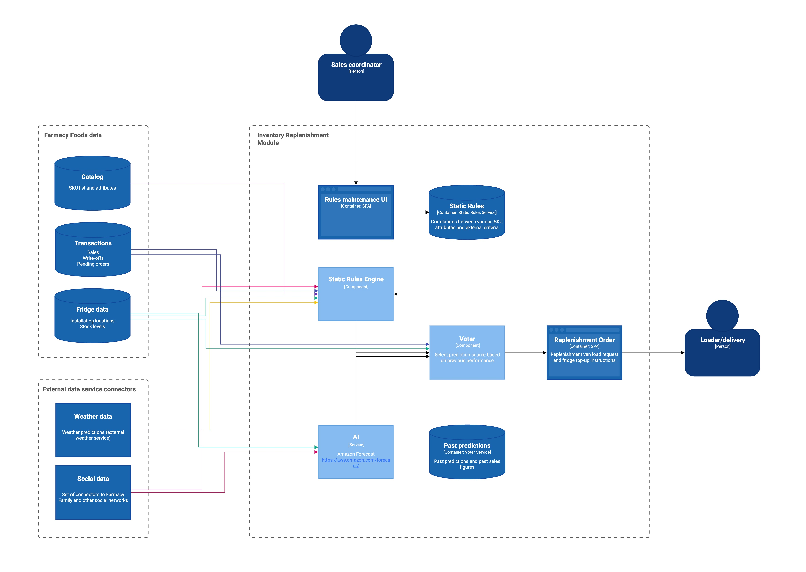

#### ADR-9: Inventory Replenishment Module

**Date**
2021-10-29

**Status**
Proposed

**Context**
Inventory Replenishment Module (IRM) maintains optimal SKU stock levels in fridges by taking into account predicted SKU popularity and actual sales results.

Assumptions:
* As per[ https://github.com/ldynia/archcolider](https://github.com/ldynia/archcolider) we are assuming that customer is using Byte Technology smart fridges capable of reporting sales and stock levels in real time.
* IRM runs in the same security context as the core application and has access to its data structures (SKU data, sales transactions).

**Decision**
SKU popularity can depend on a number of external criteria, which can be split into two broad groups: those depending on the fridge's location and, as fridges don't move on its own, essentially static such as geography, climate or demographics, and volatile such as weather, seasonality, purchase of other "companion" SKUs, social network activity, etc. 

To provide for this type of analysis IRM utilises a set of rules defining correlations between various SKU attributes and external criteria, uses these rules to determine SKU affinity to certain conditions and calculates optimal stock levels for each SKU. It then calculates the quantity of each SKU required to replace sold and expired products, provide for pick-up orders and bring stock levels in the fridge to optimal levels, and creates a delivery van load request. It should be noted that there is no requirement for delivery routing and optimisation, this development should be recommended to a customer. Installation of a new fridge or relocation of existing one interpolates rules from nearby fridges for a new location and lets user adjust them if necessary.

But the most important criterion is the actual sales and write-off figures. IRM will use Amazon Forecast AI service to analyse past sales data of each fridge, correlate it with external criteria and predict sales. 

In an established business AI model could've been trained on existing sales data, but in start-up company this data is not available, so we follow a safe adaptive approach by starting with a reasonable set of static rules and let the AI take over when ready fridge by fridge: IRM monitors accuracy of both models and uses the one, which made statistically better predictions over the past period. As static rules are used for a relatively short transitional period while AI model is being trained, no effort is made to automate the creation and maintenance of these rules as trade-off for solution cost. 

Note that Amazon Forecast has a built-in weather data provider, so weather data is not required.

We recommend the same approach for Analysis of Service Level Module and eDietician module.
