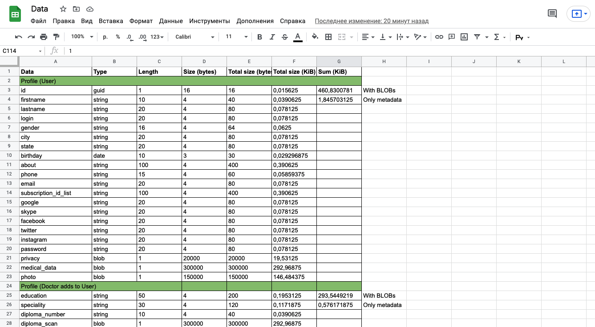

## eDietitan data flow model

We also to estimate the volumes of based on the metrics below:
* 30-50 groups per month
* 20-40 posts per month per user
* 80-100 chat messages per users per day
* 5-10 webinars per month per user

Determining the size for each stored unit of information:

Measurement of all data volumes for a month and for a year:

Link for a source file: [data.xlsx](https://docs.google.com/spreadsheets/d/1LtAQ2aVauiaGhDp_cCrl90_P26rn7ZcAbmdrNTh4zrM/edit?usp=sharing)