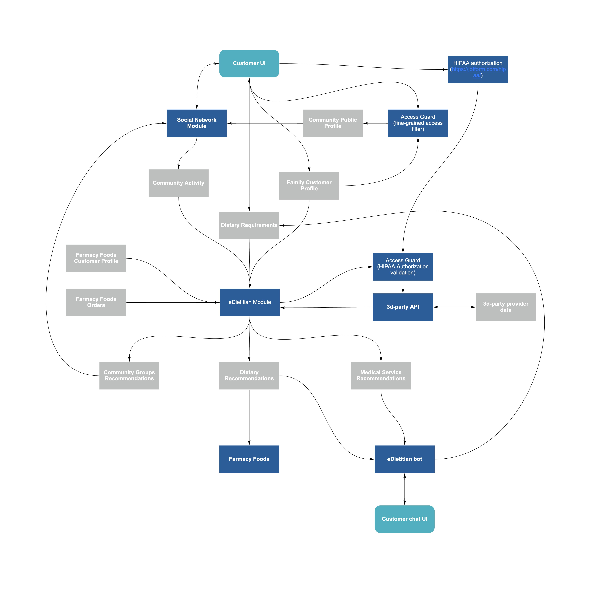

##eDietitan data flow model

**Description**
Customer maintains his/hers profile and dietary requirements via web or mobile UI and participates in interactive community provided by Social Network Module. Profile, community activity and Farmacy Foods order history (NB: Farmacy Foods account is optional) are analysed by eDietitian Module, which identifies community groups with shared interests or locations and recommends them to customers via Community Engine. It also generates Dietary and Medical Service recommendations and exchanges data with 3d party medical service providers via 3d-party API; results are communicated to customers in a more personal manner via eDietitian bot.

**Data security**
Dietary data handling procedures should comply with HIPAA requirements: data should be encrypted both when stored and in transit (TLS). In addition, medical data release to 3d parties should be authorised by a patient, authorisation process is handled by an external service provider (jotform.com). Each data item stored in a customer's profile can be made public or private; data release is handled by Access Guard processes.

