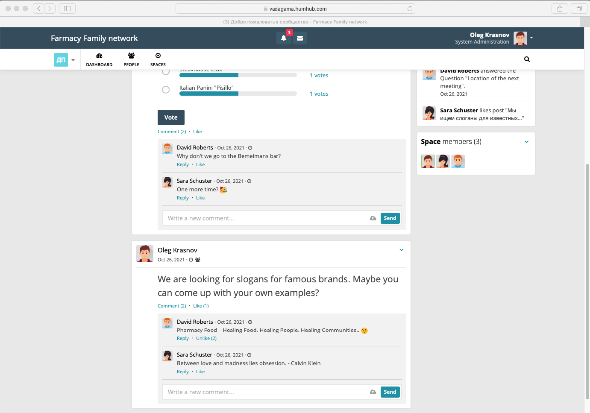
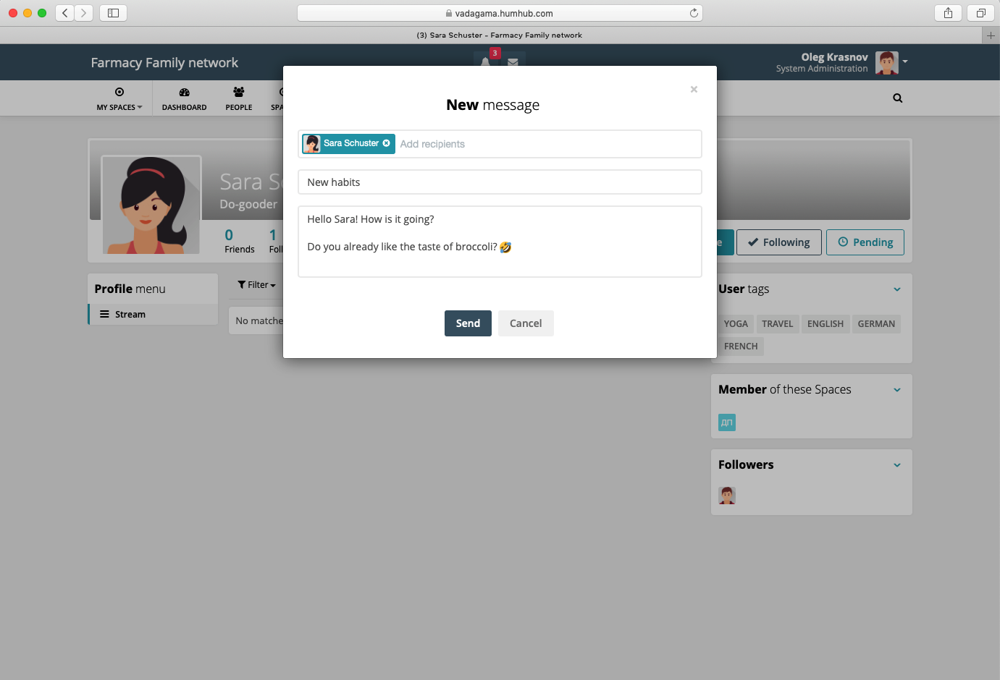
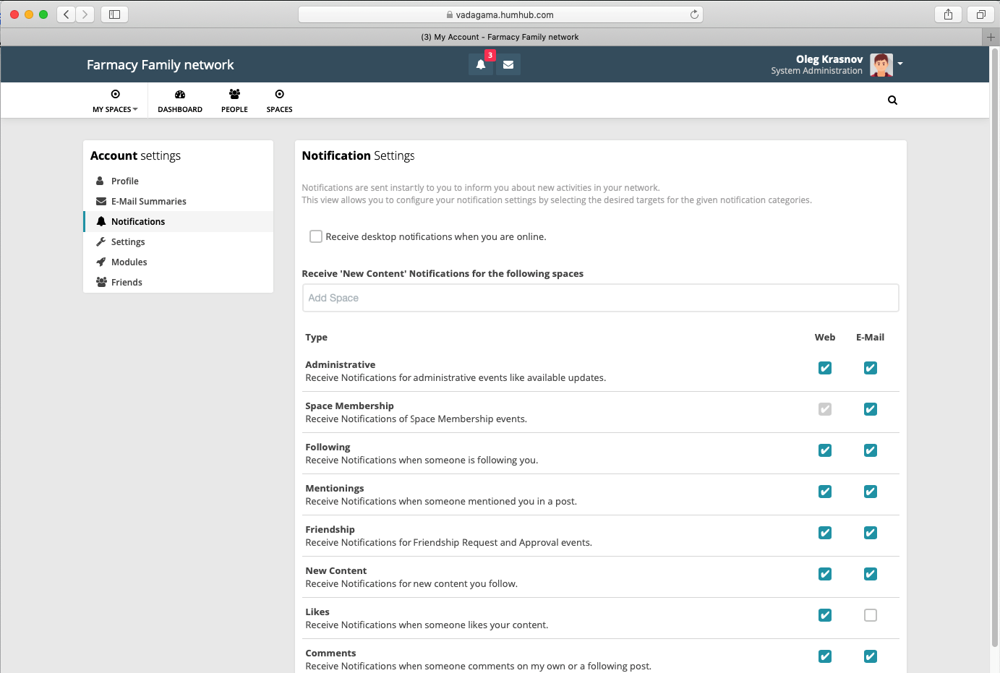
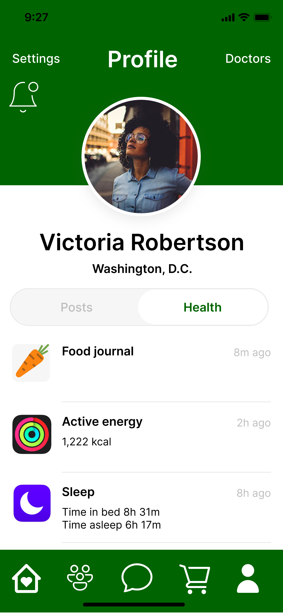
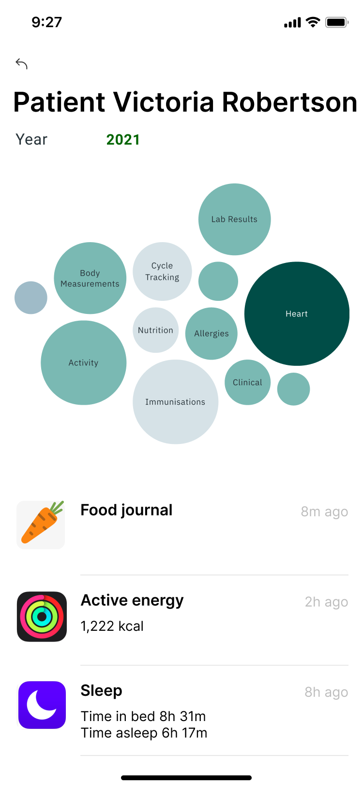
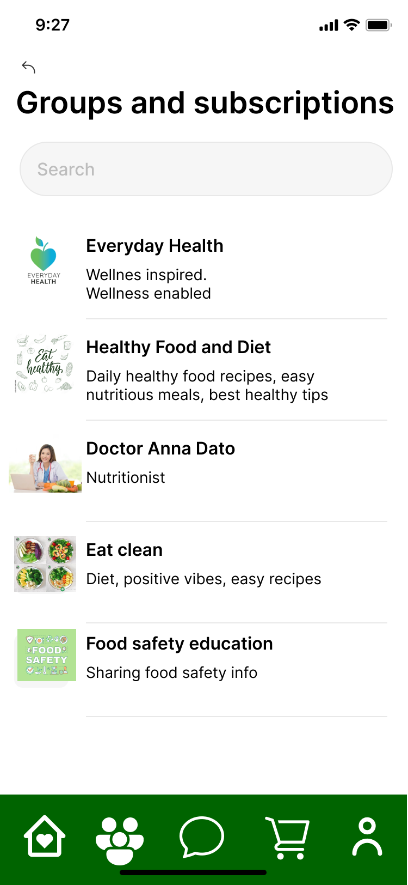
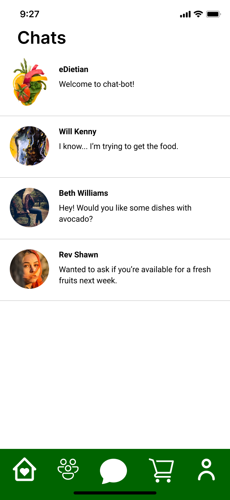
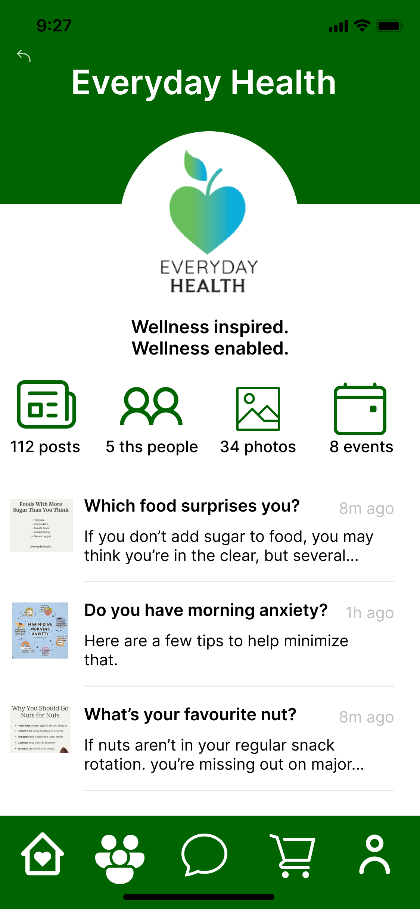
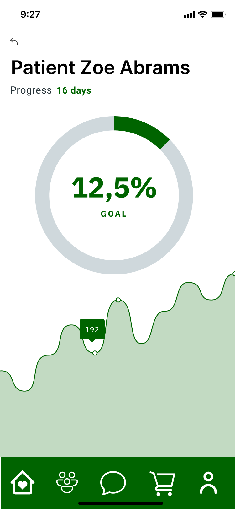

## UI Prototypes

During research process we investigated how it might look like and develop several UI prototypes of web and mobile client applications.

### Social Network UI

##### Dashboard

##### Post new message

##### Settings

### iOS client UI

##### Patient profile with data

##### Patient's medical data
 

##### Groups
 

##### Online consultation with a doctor
 

##### Messages and chats
 

##### Group Page
 

##### Goal statistics
 
